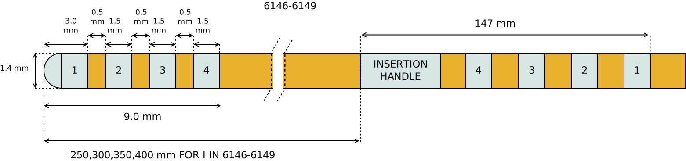

==========================
Abbott St. Jude Active Tip
==========================

* Manufacturer: Abbott / St. Jude
* Products: Abbott / St. Jude 6142- 6145, Abbott / St. Jude 6146-6149
* Models: 6142, 6143, 6144, 6145, 6146, 6147, 6148, 6149

Source documentation: `Source <https://manuals.sjm.com/~/media/manuals/product-manual-pdfs/8/6/86a4f8d2-35ab-42f8-9fa3-a53c22dda2dd.pdf>`_.
The source documentation also contains information 
about :doc:`Abbot St. Jude Directed <./Abbott_StJude_Directed>`.

-----------------------------------
St. Jude Traditional Lead 6142-6145
-----------------------------------

.. image:: electrode_pictures/St-Jude-6142-6145.svg

~~~~~~~~~~~~~~~~~~~~~~~
Default Parameters (mm)
~~~~~~~~~~~~~~~~~~~~~~~
     		* tip_length = 3.0
                * contact_length = 1.5
                * contact_spacing = 1.5
                * lead_diameter = 1.4
                * total_length = 400.0
                
	
-----------------------------------
St. Jude Traditional Lead 6146-6149
-----------------------------------
                

~~~~~~~~~~~~~~~~~~~~~~~
Default Parameters (mm)
~~~~~~~~~~~~~~~~~~~~~~~
     		* tip_length = 3.0
                * contact_length = 1.5
                * contact_spacing = 0.5
                * lead_diameter = 1.4
                * total_length = 400.0  

.. note::  The total length does not influence the computational domain that's why all the above electrodes are modeled at 400mm 

----
Code
----

.. autoclass:: ossdbs.electrodes.abbott_stjude.AbbottStJudeActiveTipModel
    :members:
    :show-inheritance:

To view examples of how to reference these electrodes, refer to the :doc:`Electrode Examples page <../Electrode_Examples>`.
