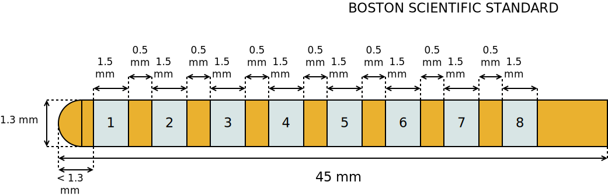

==================================
Boston Scientific Vercise
==================================
Lead: Standard Lead Lead 
Serial name: DB-2201
Manufacturer: Boston

Source documentation: `Source <https://www.bostonscientific.com/content/dam/elabeling/nm/92495783-02_Vercis_TM-DBS_Systems_Surgical_Implant_Manual_multi-OUS_s.pdf>`_.
The source documentation also contains information about
:doc:`Boston Scientific Directed Lead (DB-2202) <./Boston_Scientific_Vercise_Directed>`.

------
Code
------

.. autoclass:: ossdbs.electrodes.electrode_models.boston_scientific_vercise.BostonScientificVercise
    :members:
    :show-inheritance:
