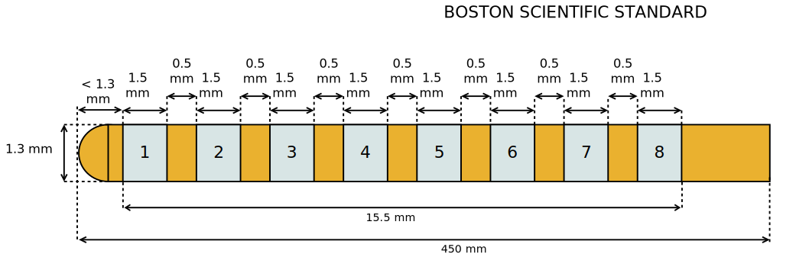

==================================
Boston Scientific Vercise
==================================
* Manufacturer: Boston Scientific
* Product: Boston Scientific Standard Lead 
* Serial name: DB-2201

Source documentation: `Source <https://www.bostonscientific.com/content/dam/elabeling/nm/92495783-02_Vercis_TM-DBS_Systems_Surgical_Implant_Manual_multi-OUS_s.pdf>`_.
The source documentation also contains information about
:doc:`Boston Scientific Directed Lead (DB-2202) <./Boston_Scientific_Vercise_Directed>`.

-----
Boston Scientific Standard Lead DB-2201
-----
                

~~~~~~~
Default Parameters (mm)
~~~~~~~ 
     		* tip_length = 1.29
                * contact_length = 1.5
                * contact_spacing = 0.5
                * lead_diameter = 1.3
                * total_length = 450.0  

-----
Code
-----

.. autoclass:: ossdbs.electrodes.boston_scientific_vercise.BostonScientificVerciseModel
    :members:
    :show-inheritance:

To view examples of how to reference these electrodes, refer to the :doc:`Electrode Examples page <../Electrode_Examples>`.

