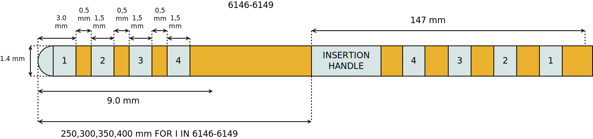

====================
Dixi Microtechniques
====================

* Manufacturer: Dixi Microtechniques
* Products: SEEG multiple channel electrodes
* Models: 10 channels, 15 channels

Source documentation: `Source <https://diximicrotechniques.com/>`_.

-------------------------------------
Dixi Microtechniques SEEG 10 channels
-------------------------------------
.. note:: TODO: Pictures need to be updated!
.. image:: electrode_pictures/St-Jude-6142-6145.svg

~~~~~~~~~~~~~~~~~~~~~~~
Default Parameters (mm)
~~~~~~~~~~~~~~~~~~~~~~~
            * tip_length=0.8,
            * contact_length=2.0,
            * contact_spacing=1.5,
            * lead_diameter=0.8,
            * total_length=400.0,

.. note::  The total length does not influence the computational domain that's why all the above electrodes are modeled at 400mm

----
Code
----

.. autoclass:: ossdbs.electrodes.dixi_microtechniques.DixiSEEG10Model
    :members:
    :show-inheritance:

-------------------------------------
Dixi Microtechniques SEEG 15 channels
-------------------------------------

~~~~~~~~~~~~~~~~~~~~~~~
Default Parameters (mm)
~~~~~~~~~~~~~~~~~~~~~~~
            * tip_length=0.8,
            * contact_length=2.0,
            * contact_spacing=1.5,
            * lead_diameter=0.8,
            * total_length=400.0,

.. note::  The total length does not influence the computational domain that's why all the above electrodes are modeled at 400mm

----
Code
----

.. autoclass:: ossdbs.electrodes.dixi_microtechniques.DixiSEEG15Model
    :members:
    :show-inheritance:
