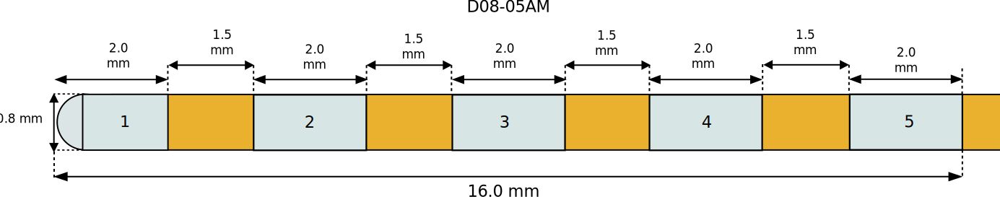
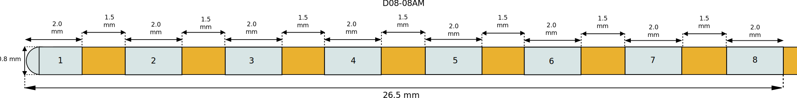

====================
Dixi Microtechniques
====================

* Manufacturer: Dixi Microtechniques
* Products: SEEG multiple channel electrodes
* Models: 5 channels, 8 channels, 10 channels, 12 channels, 15 channels

Source documentation: `Source <https://diximicrotechniques.com/>`_.

-------------------------------------
Dixi Microtechniques SEEG 5 channels
-------------------------------------

~~~~~~~~~~~~~~~~~~~~~~~
Default Parameters (mm)
~~~~~~~~~~~~~~~~~~~~~~~
            * tip_length=0.8,
            * contact_length=2.0,
            * contact_spacing=1.5,
            * lead_diameter=0.8,
            * total_length=400.0,

-------------------------------------
Dixi Microtechniques SEEG 8 channels
-------------------------------------

~~~~~~~~~~~~~~~~~~~~~~~
Default Parameters (mm)
~~~~~~~~~~~~~~~~~~~~~~~
            * tip_length=0.8,
            * contact_length=2.0,
            * contact_spacing=1.5,
            * lead_diameter=0.8,
            * total_length=400.0,

.. note::  The following electrodes with 10, 12 and 15 channels follow the same conventions.

-------------------------------------
Dixi Microtechniques SEEG 10 channels
-------------------------------------

-------------------------------------
Dixi Microtechniques SEEG 12 channels
-------------------------------------

-------------------------------------
Dixi Microtechniques SEEG 15 channels
-------------------------------------

.. note::  The total length does not influence the computational domain that's why all the above electrodes are modeled at 400mm.

----
Code
----

.. autoclass:: ossdbs.electrodes.dixi_microtechniques.DixiSEEGModel
    :members:
    :show-inheritance:
