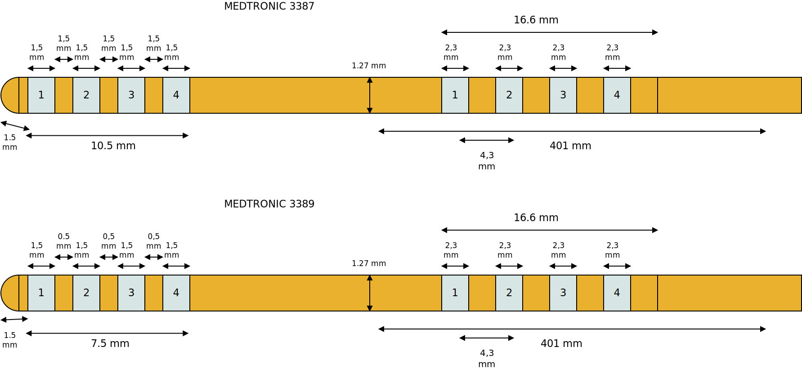
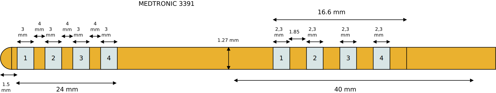

==========================
Electrodes by Medtronic
==========================

* Manufacturer: Medtronic 
* Products: Medtronic DBS 3387, Medtronic DBS 3389, Medtronic DBS 3391
* Models: 3387, 3389, 3391

------------------------
Medtronic DBS 3387/3389
------------------------

Source documentation: `Source 3387/3389 <https://www.manualslib.com/manual/1723343/Medtronic-Dbs-3389.html>`_.

------------------------
Medtronic DBS 3391
------------------------

Source documentation for model 3391: `Source 3391 <https://manuals.medtronic.com/content/dam/emanuals/neuro/M945749A045A_view.pdf>`_.

-----
Code
-----

.. autoclass:: ossdbs.electrodes.medtronic.Medtronic3387
    :members:
    :show-inheritance:

.. autoclass:: ossdbs.electrodes.medtronic.Medtronic3389
    :members:
    :show-inheritance:

.. autoclass:: ossdbs.electrodes.medtronic.Medtronic3391
    :members:
    :show-inheritance:
