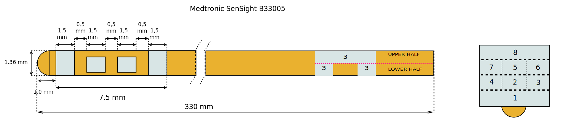
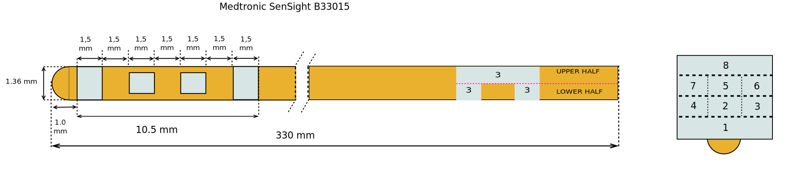

==================
Medtronic SenSight
==================

* Manufacturer: Medtronic 
* Products: Medtronic B33005, Medtronic B33015
* Models: B33005, B33015

Source documentation: `Source <https://europe.medtronic.com/xd-en/healthcare-professionals/products/neurological/deep-brain-stimulation-systems/sensight-lead.html>`_.

--------------------------------------------
Medtronic B33005 SenSight ™ directional lead
--------------------------------------------

~~~~~~~~~~~~~~~~~~~~~~~
Default Parameters (mm)
~~~~~~~~~~~~~~~~~~~~~~~

     		* tip_length = 1.0
                * contact_length = 1.5 
                * contact_spacing = 0.5
                * lead_diameter = 1.36
                * total_length = 330

--------------------------------------------            
Medtronic B33015 SenSight ™ directional lead
--------------------------------------------

~~~~~~~~~~~~~~~~~~~~~~~
Default Parameters (mm)
~~~~~~~~~~~~~~~~~~~~~~~

     		* tip_length = 1.0
                * contact_length = 1.5 
                * contact_spacing = 1.5
                * lead_diameter = 1.36
                * total_length = 330
                
----
Code
----

.. autoclass:: ossdbs.electrodes.medtronic.MedtronicSenSightModel
    :members:
    :show-inheritance:

To view examples of how to reference these electrodes, refer to the :doc:`Electrode Examples page <../Electrode_Examples>`.
