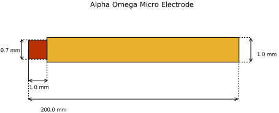

==========================
Alpha Omega MicroElectrode
==========================

* Manufacturer: Alpha Omega
* Products: MicroElectrode
* Models: MicroElectrode

Source documentation: `Source <https://www.alphaomega-eng.com/>`_.

~~~~~~~~~~~~~~~~~~~~~~~
Default Parameters (mm)
~~~~~~~~~~~~~~~~~~~~~~~
            * tip_length=1.0,
            * tip_diameter=0.7,
            * contact_length=1.0,
            * lead_diameter=1.0,
            * total_length=200.0,

.. note::  The total length does not influence the computational domain that's why all the above electrodes are modeled at 400mm.

----
Code
----

.. autoclass:: ossdbs.electrodes.microelectrode.MicroElectrodeModel
    :members:
    :show-inheritance:
