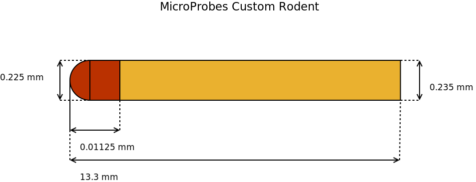

===========================
MicroProbes Custom Rodent
===========================

* Manufacturer: TODO
* Products: MicroProbes Custom Electrode
* Models: TODO

Source documentation: `TODO <https://science-products.com/en/shop/80/77/electrodes-etc/metal-microelectrodes/concentric-bipolar/snex-100>`_.
       

~~~~~~~
Default Parameters (mm)
~~~~~~~ 
     		* exposed_wire = 0
                * contact_radius = 0.1125
                * lead_radius = 0.1175
                * total_length = 13.3
                * wire_radius = 0

.. note::  The exposed_wire parameter is used to represent any exposed wire between the tip and the lead. The default parameters assume there is no exposed wire and is therefore set to zero.
-----
Code
-----

.. autoclass:: ossdbs.electrodes.micro_probes.MicroProbesRodentElectrodeModel
    :members:
    :show-inheritance:

To view examples of how to reference these electrodes, refer to the :doc:`Electrode Examples page <../Electrode_Examples>`.
