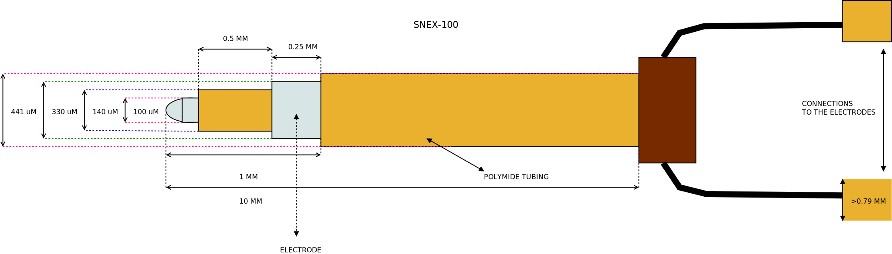

=====================
Microprobes SNEX 100 
=====================

* Manufacturer:  Microprobes
* Products: Microprobes SNEX 100
* Model: SNEX 100 
* Serial Number: CEAX-200-SS

Source documentation:
    * `Source <https://science-products.com/en/shop/80/77/electrodes-etc/metal-microelectrodes/concentric-bipolar/snex-100>`_.
    * `Source 2 <https://microprobes.com/files/pdf/catalogs/MLS-Metal_Microelectrodes_catalog.pdf>`_.

This model were designed to replicated the peter-rhodes-produced SNEX-100 concentric.

~~~~~~~~~~~~~~~~~~~~~~~
Default Parameters (mm)
~~~~~~~~~~~~~~~~~~~~~~~

     		* core_electrode_length = 0.25
                * core_electrode_diameter = 0.1
                * core_tubing_length = 0.5
                * core_tubing_diameter = 0.140
                * outer_electrode_length = 0.25
                * outer_electrode_diameter = 0.330
                * outer_tubing_diameter = 0.411
                * total_length = 100.0

----
Code
----

.. autoclass:: ossdbs.electrodes.micro_probes.MicroProbesSNEX100Model
    :members:
    :show-inheritance:

To view examples of how to reference these electrodes, refer to the :doc:`Electrode Examples page <../Electrode_Examples>`.

