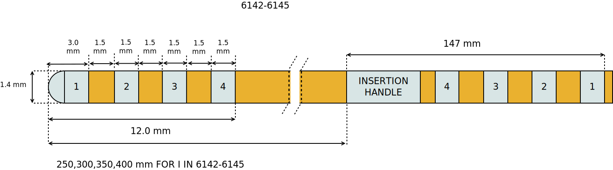
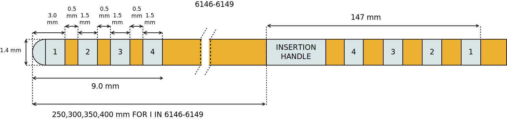

==========================
Abbott St. Jude Active Tip
==========================

* **Manufacturer:** `Abbott <https://www.abbott.com/>`_  
* **Products:** Abbott / St. Jude 6142-6145, Abbott / St. Jude 6146-6149  
* **Models:** 6142, 6143, 6144, 6145, 6146, 6147, 6148, 6149  

Source documentation: `Source <https://manuals.sjm.com/~/media/manuals/product-manual-pdfs/8/6/86a4f8d2-35ab-42f8-9fa3-a53c22dda2dd.pdf>`_.  
The source documentation also contains information about :doc:`Abbott St. Jude Directed <./Abbott_StJude_Directed>`.

-----------------------------------
St. Jude Traditional Lead 6142-6145
-----------------------------------

~~~~~~~~~~~~~~~~~~~~~~~
Default Parameters (mm)
~~~~~~~~~~~~~~~~~~~~~~~

* tip_length = 3.0
* contact_length = 1.5
* contact_spacing = 1.5
* lead_diameter = 1.4
* total_length = 400.0

-----------------------------------
St. Jude Traditional Lead 6146-6149
-----------------------------------

~~~~~~~~~~~~~~~~~~~~~~~
Default Parameters (mm)
~~~~~~~~~~~~~~~~~~~~~~~

* tip_length = 3.0
* contact_length = 1.5
* contact_spacing = 0.5
* lead_diameter = 1.4
* total_length = 400.0  

----
Code
----

.. autoclass:: ossdbs.electrodes.abbott_stjude.AbbottStJudeActiveTipModel
    :members:  
    :show-inheritance:  
