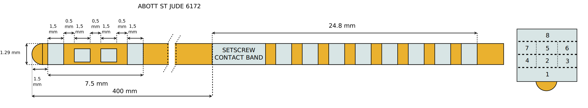
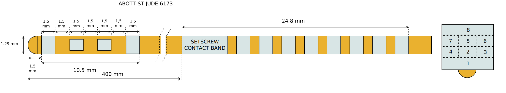

========================
Abbott St. Jude Directed
========================

* **Manufacturer:** `Abbott <https://www.abbott.com/>`_
* **Products:** Abbott / St. Jude 6172, Abbott / St. Jude 6173  
* **Models:** 6172, 6173  

Source documentation: `Source <https://manuals.sjm.com/~/media/manuals/product-manual-pdfs/8/6/86a4f8d2-35ab-42f8-9fa3-a53c22dda2dd.pdf>`_.  
The source documentation also contains information about :doc:`Abbott St. Jude Active Tip <./Abbott_Active_Tip>`.

-------------------------------------------------
St. Jude Medical Infinity ™ Directional Lead 6172
-------------------------------------------------

~~~~~~~~~~~~~~~~~~~~~~~
Default Parameters (mm)
~~~~~~~~~~~~~~~~~~~~~~~

* tip_length = 1.0
* contact_length = 1.5
* contact_spacing = 0.5
* lead_diameter = 1.29
* total_length = 400.0

-------------------------------------------------
St. Jude Medical Infinity ™ Directional Lead 6173
-------------------------------------------------

~~~~~~~~~~~~~~~~~~~~~~~
Default Parameters (mm)
~~~~~~~~~~~~~~~~~~~~~~~

* tip_length = 1.0
* contact_length = 1.5
* contact_spacing = 1.5
* lead_diameter = 1.29
* total_length = 400.0

----
Code
----

.. autoclass:: ossdbs.electrodes.abbott_stjude.AbbottStJudeDirectedModel
    :members:  
    :show-inheritance:  
