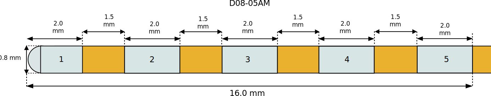
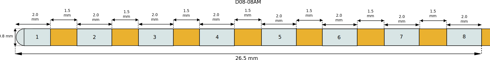

====================
Dixi Microtechniques
====================

* **Manufacturer:** `Dixi Microtechniques <https://diximicrotechniques.com/>`_
* **Products:** SEEG multiple channel electrodes  
* **Models:** 5 channels, 8 channels, 10 channels, 12 channels, 15 channels, 18 channels  

Source documentation: `Source <https://diximicrotechniques.com/>`_  

-------------------------------------
Dixi Microtechniques SEEG 5 channels
-------------------------------------

~~~~~~~~~~~~~~~~~~~~~~~
Default Parameters (mm)
~~~~~~~~~~~~~~~~~~~~~~~

* tip_length = 2.0  
* contact_length = 2.0  
* contact_spacing = 1.5  
* lead_diameter = 0.8  
* total_length = 400.0  

-------------------------------------
Dixi Microtechniques SEEG 8 channels
-------------------------------------

~~~~~~~~~~~~~~~~~~~~~~~
Default Parameters (mm)
~~~~~~~~~~~~~~~~~~~~~~~

* tip_length = 2.0  
* contact_length = 2.0  
* contact_spacing = 1.5  
* lead_diameter = 0.8  
* total_length = 400.0  

.. note:: The following electrodes with 10, 12, 15 and 18 channels follow the same conventions.

-------------------------------------
Dixi Microtechniques SEEG 10 channels
-------------------------------------

(No unique image or parameters provided)

-------------------------------------
Dixi Microtechniques SEEG 12 channels
-------------------------------------

(No unique image or parameters provided)

-------------------------------------
Dixi Microtechniques SEEG 15 channels
-------------------------------------

(No unique image or parameters provided)

-------------------------------------
Dixi Microtechniques SEEG 18 channels
-------------------------------------

(No unique image or parameters provided)

----
Code
----

.. autoclass:: ossdbs.electrodes.dixi_microtechniques.DixiSEEGModel
    :members:  
    :show-inheritance:  
