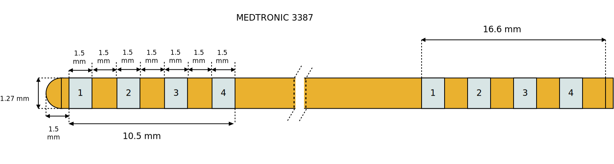
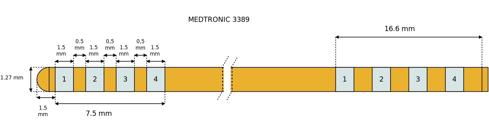
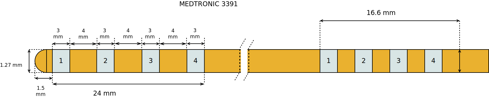

=============
Medtronic DBS
=============

* **Manufacturer:** `Medtronic <https://www.medtronic.com/me-en/index.html>`_  
* **Products:** Medtronic DBS 3387, Medtronic DBS 3389, Medtronic DBS 3391  
* **Models:** 3387, 3389, 3391  

Source documentation for models 3387 and 3389: `Source 3387/3389 <https://www.manualslib.com/manual/1723343/Medtronic-Dbs-3389.html>`_  
Source documentation for model 3391: `Source 3391 <https://manuals.medtronic.com/content/dam/emanuals/neuro/M945749A045A_view.pdf>`_  

------------------
Medtronic DBS 3387
------------------

~~~~~~~~~~~~~~~~~~~~~~~
Default Parameters (mm)
~~~~~~~~~~~~~~~~~~~~~~~

* tip_length = 1.5  
* contact_length = 1.5  
* contact_spacing = 1.5  
* lead_diameter = 1.27  
* total_length = 400.0  

------------------
Medtronic DBS 3389
------------------

~~~~~~~~~~~~~~~~~~~~~~~
Default Parameters (mm)
~~~~~~~~~~~~~~~~~~~~~~~

* tip_length = 1.5  
* contact_length = 1.5  
* contact_spacing = 0.5  
* lead_diameter = 1.27  
* total_length = 400.0  

------------------
Medtronic DBS 3391
------------------

~~~~~~~~~~~~~~~~~~~~~~~
Default Parameters (mm)
~~~~~~~~~~~~~~~~~~~~~~~

* tip_length = 1.5  
* contact_length = 3.0  
* contact_spacing = 4.0  
* lead_diameter = 1.27  
* total_length = 400.0  

----
Code
----

.. autoclass:: ossdbs.electrodes.medtronic.MedtronicModel
    :members:  
    :show-inheritance:  
