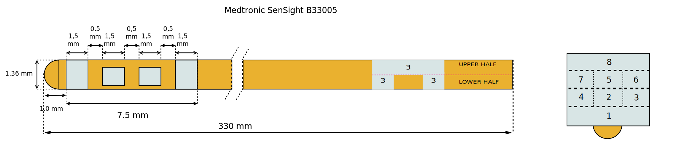
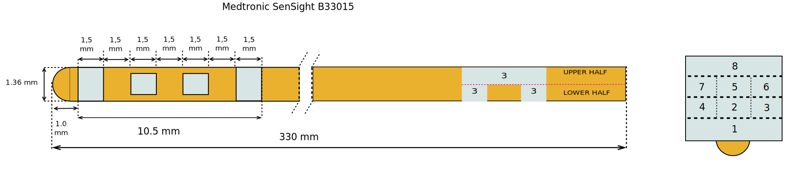

==================
Medtronic SenSight
==================

* **Manufacturer:** `Medtronic <https://www.medtronic.com/me-en/index.html>`_   
* **Products:** Medtronic B33005, Medtronic B33015  
* **Models:** B33005, B33015  

Source documentation: `Medtronic SenSight Lead Documentation <https://europe.medtronic.com/xd-en/healthcare-professionals/products/neurological/deep-brain-stimulation-systems/sensight-lead.html>`_

--------------------------------------------
Medtronic B33005 SenSight ™ Directional Lead
--------------------------------------------

~~~~~~~~~~~~~~~~~~~~~~~
Default Parameters (mm)
~~~~~~~~~~~~~~~~~~~~~~~

* tip_length = 0.9
* contact_length = 1.5 
* contact_spacing = 0.5
* lead_diameter = 1.36
* total_length = 330

--------------------------------------------            
Medtronic B33015 SenSight ™ Directional Lead
--------------------------------------------

~~~~~~~~~~~~~~~~~~~~~~~
Default Parameters (mm)
~~~~~~~~~~~~~~~~~~~~~~~

* tip_length = 0.9
* contact_length = 1.5 
* contact_spacing = 1.5
* lead_diameter = 1.36
* total_length = 330

----
Code
----

.. autoclass:: ossdbs.electrodes.medtronic.MedtronicSenSightModel
    :members:  
    :show-inheritance:  
