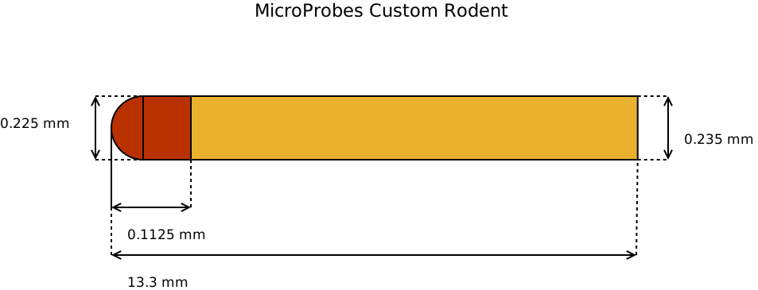

=========================
MicroProbes Custom Rodent
=========================

* **Manufacturer:** `MicroProbes for Life Science <https://microprobes.com/>`_   
* **Products:** MicroProbes Custom Electrode  
* **Models:** Custom  

Source documentation: `MicroProbes for Life Science <https://microprobes.com/>`_  

~~~~~~~~~~~~~~~~~~~~~~~
Default Parameters (mm)
~~~~~~~~~~~~~~~~~~~~~~~

* exposed_wire = 0  
* contact_radius = 0.1125  
* lead_radius = 0.1175  
* total_length = 13.3  
* wire_radius = 0  

.. note:: The `exposed_wire` parameter is used to represent any exposed wire between the tip and the lead. The default parameters assume there is no exposed wire and is therefore set to zero.

----
Code
----

.. autoclass:: ossdbs.electrodes.micro_probes.MicroProbesRodentElectrodeModel
    :members:  
    :show-inheritance:  
