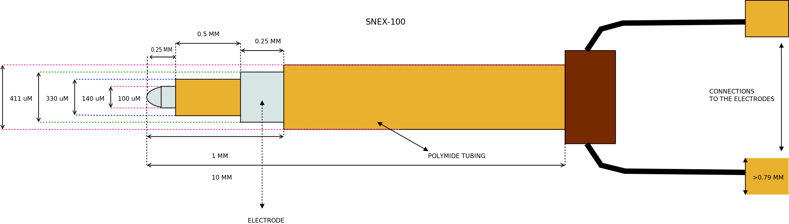

=====================
MicroProbes SNEX 100
=====================

* **Manufacturer:** `MicroProbes for Life Science <https://microprobes.com/>`_  
* **Products:** MicroProbes SNEX 100  
* **Model:** SNEX 100  
* **Serial Number:** CEAX-200-SS  

Source documentation:  
* `Source <https://science-products.com/en/shop/80/77/electrodes-etc/metal-microelectrodes/concentric-bipolar/snex-100>`_  
* `Source 2 <https://microprobes.com/files/pdf/catalogs/MLS-Metal_Microelectrodes_catalog.pdf>`_  

This model was designed to replicate the Peter-Rhodes-produced SNEX-100 concentric electrode.

~~~~~~~~~~~~~~~~~~~~~~~
Default Parameters (mm)
~~~~~~~~~~~~~~~~~~~~~~~

* core_electrode_length = 0.25  
* core_electrode_diameter = 0.1  
* core_tubing_length = 0.5  
* core_tubing_diameter = 0.140  
* outer_electrode_length = 0.25  
* outer_electrode_diameter = 0.330  
* outer_tubing_diameter = 0.411  
* total_length = 100.0  

----
Code
----

.. autoclass:: ossdbs.electrodes.micro_probes.MicroProbesSNEX100Model
    :members:  
    :show-inheritance:  
