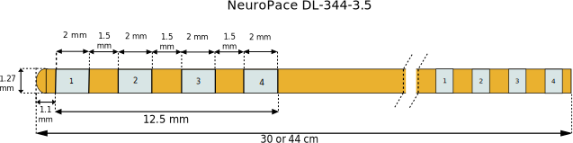
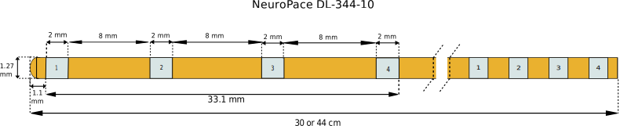

==========
Neuro Pace
==========

* **Manufacturer:** `NeuroPace, Inc. <https://www.neuropace.com/>`_
* **Products:** NeuroPace DL-344  
* **Models:** 3.5, 10  

Source documentation for model 3.5: `Source DL-344-3.5 <https://www.manualslib.com/products/Neuropace-Neuropace-Dl-344-3-5-10896050.html>`_  
Source documentation for model 10: `Source DL-344-10 <https://www.manualslib.com/products/Neuropace-Neuropace-Dl-344-10-10896052.html>`_  

---------------------
Neuro Pace DL-344-3.5
---------------------

~~~~~~~~~~~~~~~~~~~~~~~
Default Parameters (mm)
~~~~~~~~~~~~~~~~~~~~~~~

* tip_length = 1.1  
* contact_length = 2.0  
* contact_spacing = 1.5  
* lead_diameter = 1.27  
* total_length = 400.0  

--------------------
Neuro Pace DL-344-10
--------------------

~~~~~~~~~~~~~~~~~~~~~~~
Default Parameters (mm)
~~~~~~~~~~~~~~~~~~~~~~~

* tip_length = 1.1  
* contact_length = 2.0  
* contact_spacing = 8.0  
* lead_diameter = 1.27  
* total_length = 400.0  

----
Code
----

.. autoclass:: ossdbs.electrodes.neuro_pace.NeuroPaceModel
    :members:  
    :show-inheritance:  
